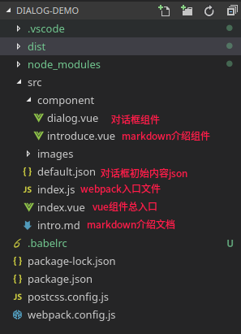

# 对话框demo
---
### 基于webpack的vue组件化开发

项目目录结构如下



---
## 重难点
### 逻辑解耦
- 将聊天框组件化，可复用
  + 聊天框内部通过指定用户名称来识别不同聊天框下的用户对象
  + 通过比对用户名称为消息数组的元素赋值不同class(他人消息放左侧，自己消息放右侧)
- 将用户用一个数组对象存储，在父级组件上用`v-for`实现循环挂载聊天框组件，实现多对象聊天
- 将多个聊天框的内容通过同一个父级数组对象传入，*通过数据绑定与子组件`$emit`的方式实现父子组件之间的通信*
- 将markdown文档说明附带触发的按钮封装为一个组件，方便以后复用

### 聊天框始终置于底部
实现的重点在于修改`scrollTop`为`scrollHeight`，**难点**在于修改滚动的时机
- 在节点挂载`mounted`(*读取默认聊天内容并填充*)之后设置
``` 
  mounted() {
    this.$refs.dialog_body.scrollTop = this.$refs.dialog_body.scrollHeight;
  },
```
- 在用户发送完消息之后，如果直接修改scrollTop是无效的(*因为读取到的scrollHeight是数据修改前的可滚动高度*)，**需要延迟到下一个渲染周期，也就是发送到父组件的数据更新后的下一次渲染**
```
  watch: {
    msgs(val, oldVal) {
      // 延迟到下一次渲染更新的时候
      this.$nextTick(() => {
        this.$refs.dialog_body.scrollTop = this.$refs.dialog_body.scrollHeight;
      })
    }
  }
```

### markdown文档说明内容的编译与插入
webpack对于`md`文件的读取配置
```
{
  test: /\.md$/,
  use: [
    {
      loader: 'vue-loader'
    },
    {
      loader: 'vue-markdown-loader/lib/markdown-compiler',
      options: {
        wrapper: 'article',
        raw: true // 保证换行不会变成\n等
      }
    }
  ]
}
```
  + 使用`vue-markdown-loader`内部compiler实现markdown文件的读取编译
  + 使用`vue-loader`将读取的markdown内容转化为vue组件对象，通过标签插入到父组件中

### ！！markdown组件的动态加载md文件
- 对于文档说明组件，会根据传入的文件名`mdfile`，返回到`/src`目录中查找对应的`md`文件，动态的构成markdown子组件
- 这种情况下如果仍然使用`components`属性来设置调用的组件的话是无法获取传入的参数`this.$props`的
```
  created() {
    this.$options.components.md = () => import('../' + this.$props.mdfile);
  }
```

### 移动端拖动兼容
- 由于在移动端的`mouse`事件都被`touch`事件替代，所以需要额外添加`touchstart` `touchmove` `touchend`事件
- 注意无论是移动端还是pc端都需要对事件`preventDefault`(即`.prevent`)
- 对于`TouchEvent`的位置获取，需要`ev.touches[0].clientX`来获取，不同于`MouseEvent`的`ev.clientX`直接获取